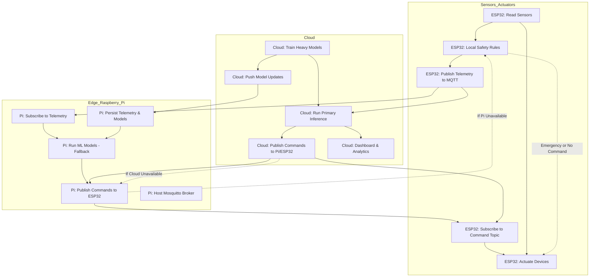

# IOTricity\_Nanites


**IoT Smart Greenhouse Control System** — the Nanites project.

---

## Setup & Quickstart (Windows, PowerShell)

1. **Create and activate Python virtual environment:**
  ```powershell
  python -m venv .venv
  .venv\Scripts\Activate.ps1
  ```

2. **Install dependencies:**
  ```powershell
  pip install -r requirements.txt
  ```

3. **Start MQTT broker (Docker, with config):**
  ```powershell
  docker run -d --name mosquitto -p 1883:1883 -v ${PWD}\mosquitto\config\mosquitto.conf:/mosquitto/config/mosquitto.conf eclipse-mosquitto:latest
  ```

4. **Generate synthetic data:**
  ```powershell
  cd AI/src
  python generate_synthetic.py
  ```

5. **Train models:**
  ```powershell
  python train_irrigation.py --data ../data/synthetic_greenhouse_7days_10min.csv --outdir ../models
  python train_anomaly.py --data ../data/synthetic_greenhouse_7days_10min.csv --outdir ../models
  ```

6. **Start inference service:**
  ```powershell
  python infer_service.py
  ```

7. **Publish simulated telemetry (in another terminal):**
  ```powershell
  python mqtt_publisher_demo.py
  ```

8. **Run dashboard:**
  ```powershell
  streamlit run streamlit_dashboard.py
  ```

---

---

## Project summary

An IoT-powered Smart Greenhouse Control System that monitors and automates greenhouse conditions using distributed sensors, actuators, and AI-driven decision making. The system focuses on keeping crops in their optimal bands (temperature, humidity, VPD, soil moisture, PPFD, CO₂) while conserving resources (water, energy) and providing remote monitoring & alerts.

The repository contains the AI components (training, inference services, demo pipelines) for irrigation optimization, anomaly detection, and support for climate control and yield prediction.

---

## Quick features

* **Real-time monitoring:** Temperature, humidity, soil moisture, light (PPFD/lux), CO₂.
* **AI-powered automation:** Models suggest irrigation timing/volume, detect anomalies, and recommend climate setpoints.
* **Automated irrigation & ventilation:** Actuators triggered automatically, with manual override via dashboard.
* **Remote access & alerts:** Web/mobile dashboard, push/SMS/Telegram alerts for critical events.
* **Resilient design:** ESP32 handles local safety rules; Raspberry Pi acts as edge inference and gateway; Cloud for heavy ML and model training.

---

## System Workflow Flowchart



## System Architecture & Responsibility Split

### ESP32 (Primary Hardware Controller)
- Reads sensors at short loop (1–10s).
- Enforces hard safety (emergency cutoffs, watchdog timers, max on-duration).
- Runs local rules/PID for immediate control when no remote command (guarantee minimum operation).
- Publishes telemetry to MQTT and subscribes to command topics.
- Acts on trusted cloud/Pi commands when fresh (timestamp < expiry & not older than N seconds).
- Sends heartbeat / device status at regular intervals.

### Raspberry Pi (Local Edge / Fallback)
- Subscribes to telemetry, runs lightweight ML models (fallback inference).
- When cloud unavailable, Pi becomes primary decision-maker (publishes commands to ESP).
- Persists telemetry, local storage, and model caching.
- Optional: hosts Mosquitto broker.

### Cloud
- Trains heavy models (RL, MPC, CV, yield prediction).
- Serves the "primary" AI inference (publish setpoints/commands).
- Provides dashboard, alerts, historic analytics.
- Pushes model updates to Pi; orchestrates model versions.

**Failover order:** Cloud (primary) → Pi (fallback) → ESP (safety/local rules).

#### Key Failover Logic
- **ESP logic (priority order):**
  - If a valid command (source cloud or Pi) has been received and is fresh, apply it. Record last_cmd_id and last_cmd_ts.
  - If no fresh command, run local rules/PID for immediate safety control.
  - Emergency condition (e.g., T > critical_temp or sensor invalid): override everything and go to safe shutdown (turn off heater, open vents, alert over MQTT).
  - Publish heartbeat/status at regular interval (e.g., 30s). If no heartbeat for X minutes, cloud/Pi can flag device offline.
- **Pi logic:**
  - Subscribe to telemetry. If cloud commands absent, Pi runs fallback models and publishes commands to greenhouse/{bay}/cmd (with "source":"pi").
  - If Pi cannot reach cloud, continue to serve until cloud returns. Pi must add last_cloud_seen metadata to commands.
- **Cloud logic:**
  - Send commands to greenhouse/{bay}/cmd. Cloud commands should include expires_at and cmd_id. Cloud should monitor status and if not receiving heartbeat, reduce automation risk (e.g., send conservative setpoints once connectivity returns).

---

---


## Sensor Hardware Summary

| Sensor         | Purpose                           | Output      | Voltage   | Range / Notes                 |
|---------------|-----------------------------------|------------|----------|-------------------------------|
| MQ2           | CO₂ / Gas Detection (simulated)   | Analog/Digital | 5V       | Detects CO₂, LPG, methane    |
| Potentiometer | Soil Moisture Simulation           | Analog      | 5V       | Variable analog value        |
| LDR           | Sunlight Measurement               | Analog      | 3.3V–5V  | Light-dependent resistance   |
| DHT22         | Temperature & Humidity             | Digital     | 3.3V–6V  | Accurate temp & RH readings  |

*For real-world use, replace simulation sensors with calibrated CO₂ and soil moisture sensors.*

---

---

## Where models run (deployment split)

* **ESP32 (edge)**: sensor reads, threshold safety rules, actuator driving, heartbeat & retries. *No heavy ML.*
* **Raspberry Pi (local/gateway)**: lightweight ML inference (scikit-learn/XGBoost), sensor fusion, anomaly detection, small CV models if required (TinyYOLO / TensorFlow Lite). Acts as the primary runtime when cloud is unreachable.
* **Cloud**: training, large-model inference (full YOLO, RL/MPC, LSTM), data lake, model registry, dashboards, multi-bay coordination.

---


## AI Components & Workflow

**Data Generation & Loading**
- `generate_synthetic.py`: Generates synthetic greenhouse sensor data for 7 days at 10-minute intervals, simulating temperature, humidity, light, CO₂, soil moisture, and irrigation events. Uses config for output path.
- `Dataset_10min.py`: Downloads a real greenhouse sensor dataset from Kaggle for experimentation.

**Model Training**
- `train_irrigation.py`: Loads synthetic data, engineers features, and trains a Random Forest regressor to predict soil moisture 6 hours ahead. Saves model and test metrics.
- `train_anomaly.py`: Loads data, trains Isolation Forest model to detect anomalies. Saves model and metadata.

**Real-Time Inference & Streaming**
- `infer_service.py`: Loads trained models, runs an MQTT-based inference service. Subscribes to telemetry, predicts future soil moisture, checks for anomalies, and publishes results/alerts/commands to MQTT topics.
- `mqtt_publisher_demo.py`: Publishes synthetic telemetry data row-by-row to the MQTT broker, simulating real-time sensor streaming for demo/testing.

**Visualization**
- `streamlit_dashboard.py`: Streamlit app for visualizing recent greenhouse data and live MQTT data. Loads CSV using robust path resolution.

**Prediction Scripts & Utilities**
- `predict_irrigation.py`, `predict_anomaly.py`: Model prediction scripts, config-driven.
- `utils.py`: Helper functions for path/model management.

**Workflow Summary**
1. Generate synthetic data or download real data.
2. Train irrigation and anomaly detection models.
3. Start MQTT broker (Docker or public broker).
4. Run inference service to process live telemetry.
5. Publish demo telemetry data.
6. Visualize results in Streamlit dashboard.

---

---

## Data format (suggested telemetry JSON)

```json
{
  "ts": "2025-08-30T09:30:00Z",
  "bayId": "A1",
  "env": {"T": 26.4, "RH": 72.1, "VPD": 0.9, "CO2": 850, "PPFD": 320},
  "soil": {"theta": 0.29, "EC": 1.4, "T": 22.1},
  "ext": {"T": 31.2, "RH": 60, "wind": 2.4, "solar": 700},
  "actuators": {"fan": 0, "heater": 0, "irrigation": 0, "led": 0.7},
  "et0": 4.2,
  "alerts": []
}
```

---

## Quickstart — AI-side (run locally / on Pi)

**Environment**

```bash
python -m venv venv
source venv/bin/activate
pip install --upgrade pip
pip install pandas numpy scikit-learn xgboost joblib fastapi uvicorn paho-mqtt streamlit
```

**Run the demo pipeline (synthetic data)**

1. Place CSV in `data/` (synthetic dataset provided in `/data`).
2. Train irrigation model: `python src/train_irrigation.py` (produces `models/irrigation_model.pkl`).
3. Train anomaly detector: `python src/train_anomaly.py` (produces `models/anomaly_iforest.pkl`).
4. Start MQTT broker (Mosquitto) on Pi: `sudo apt install mosquitto` then `sudo systemctl start mosquitto`.
5. Start inference service: `python src/infer_service.py`.
6. Stream demo telemetry: `python src/mqtt_publisher_demo.py`.
7. Open dashboard: `streamlit run src/streamlit_dashboard.py`.

---

## 36-hour focused AI plan (what to deliver)

* **Irrigation model + metrics** (MAE, simulated water saved).
* **IsolationForest anomaly detector** (precision/recall on synthetic anomalies).
* **Inference service (Pi-ready)** publishing to MQTT topics.
* **Streamlit dashboard** showing telemetry, predictions, and alerts.
* **Demo script** that plays synthetic telemetry at accelerated speed.

---


## MQTT Topics (Standardized)

- `greenhouse/{bay}/tele` → raw JSON telemetry.
- `greenhouse/{bay}/pred` → model outputs (predicted soil moisture, recommended liters).
- `greenhouse/{bay}/alert` → anomaly & critical alerts.
- `greenhouse/{bay}/cmd` → actuator commands (from Pi or cloud).

---

---


## Safety, Guardrails & Best Practices

- Local fallback safety rules on ESP32 (hard cutoffs, min/max runtimes).
- Actuator interlocks (no CO₂ enrichment while vents open).
- Model & device heartbeats — Pi falls back to safe defaults if cloud unreachable.
- Signed OTA & per-device credentials for production.
- **Timing & latency:** Control loops requiring sub-second response should remain local on ESP (safety). Cloud decisions are higher-level (setpoints, schedules, ML optimization).
- **Security:** For production use TLS + auth on MQTT and signed commands. For hackathon, plain MQTT is OK.
- **CO₂:** Replace MQ-2 with SCD30/MH-Z19 for meaningful CO₂ control.
- **Data drift:** Retrain cloud models with real telemetry frequently; Pi should pull model updates and cache them.

---

---


## File Structure

```
/ (root)
├─ AI/
│   ├─ data/                  # synthetic and real datasets
│   ├─ models/                # trained models (.pkl)
│   ├─ src/                   # all scripts for data, training, inference, streaming, and visualization
│   │    ├─ train_irrigation.py
│   │    ├─ train_anomaly.py
│   │    ├─ infer_service.py
│   │    ├─ mqtt_publisher_demo.py
│   │    ├─ streamlit_dashboard.py
│   │    ├─ utils.py
│   │    ├─ predict_irrigation.py
│   │    ├─ predict_anomaly.py
│   │    ├─ pi_fallback.py
│   │    ├─ cloud_controller.py
│   ├─ config.yaml            # central config for all scripts
├─ data/                      # CSVs (synthetic + collected telemetry)
├─ docs/                      # hardware lists, diagrams, deeper docs
├─ models/                    # trained models (.pkl)
├─ README.md                  # this file
└─ LICENSE
```

---

---


## Future Enhancements

- Weather API integration for ET₀ forecasting and feedforward control.
- Full CV pipeline for fruit counting & disease detection.
- MPC / RL for multi-actuator coordination and energy optimization.
- LoRaWAN integration for large-farm coverage and mesh-controlled nodes.

---

---

## Contributing

If you add hardware, datasets, or new models, update `docs/full-hardware.md` and `docs/model-registry.md`. Create a clear `model-metadata.json` (name, version, sha256, trained-on-date).

---

## License

MIT

---


---

## Bonus: Notes, Improvements & Gotchas

- **Timing & latency:** Control loops requiring sub-second response should remain local on ESP (safety). Cloud decisions are higher-level (setpoints, schedules, ML optimization).
- **Security:** For production use TLS + auth on MQTT and signed commands. For hackathon, plain MQTT is OK.
- **CO₂:** Replace MQ-2 with SCD30/MH-Z19 for meaningful CO₂ control.
- **Data drift:** Retrain cloud models with real telemetry frequently; Pi should pull model updates and cache them.

---
